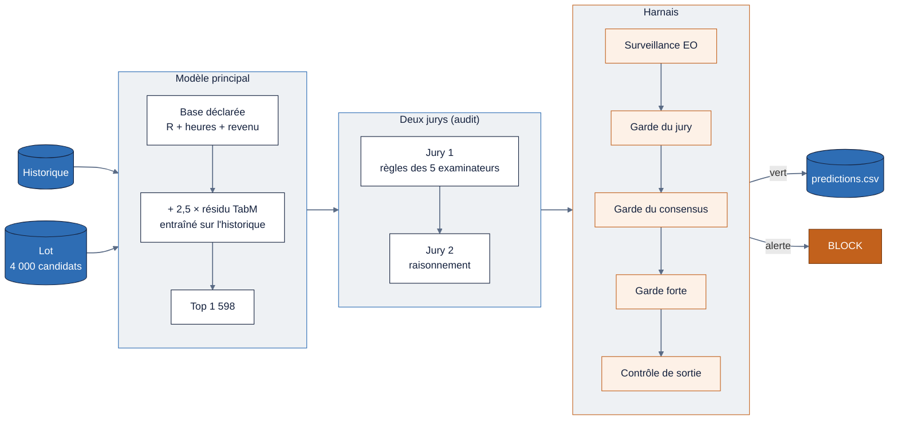

# Chaîne de décision

Vue d'ensemble de `python -m src.main decide`. Les deux jurys tournent en mode audit : ils votent et tracent, sans
modifier les décisions.

| Étape | Rôle | Action possible |
|---|---|---|
| Base déclarée | z(cote R) + 0,185·z(heures) + 0,025·z(log revenu), pénalité régionale du comité (−1,90 logit) retirée | — |
| Résidu TabM | 4 réseaux entraînés sur l'historique (Kaggle), artefact `models/tabm_residual_ensemble_rh` | — |
| Top 1 598 | budget historique 39,94 % des 4 000 candidats | — |
| Jury 1 | 5 règles des examinateurs (`docs/reviews/consensus.json`) votent sur les cas limites, quorum 0,8 | vote seulement |
| Jury 2 | raisonnement sur cote R, heures, consensus, jusqu'à 3 rondes | trace seulement |
| Surveillance EO | écart signé vs mérite dans −0,09..+0,05 | `ADJUST_OFFSET` (\|δ\| ≤ 0,10) |
| Garde du jury | effet du jury sur l'équité ≤ 0,01 | `REVERT_JURY` |
| Garde du consensus | limites tirées des 5 examinateurs | `BLOCK` |
| Garde forte | ratio d'impact ≥ 0,90, sous-groupes, 5 régions, coût du revenu ≤ 5 % | `BLOCK` |
| Contrôle de sortie | identifiants, nombre d'octrois | `BLOCK` |

Sorties publiées : `predictions.csv`, `decision_record.json`, `explanations.csv` (3 facteurs par personne, Loi 25).
Sur le lot actuel : aucun décalage, aucun retrait de jury, toutes les gardes au vert, statut `published`.
